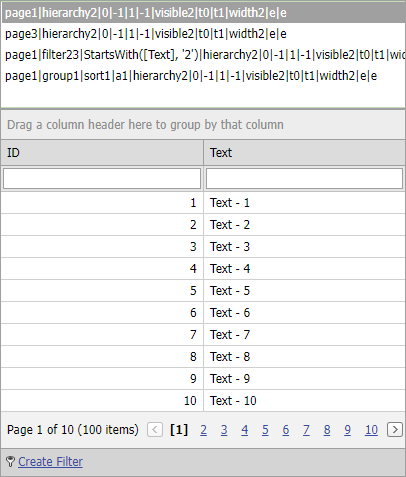

<!-- default badges list -->

[](https://supportcenter.devexpress.com/ticket/details/T146962)
[](https://docs.devexpress.com/GeneralInformation/403183)
<!-- default badges end -->

# Grid View for ASP.NET MVC - How to use a list box editor to save and restore client layout
<!-- run online -->
**[[Run Online]](https://codecentral.devexpress.com/t146962/)**
<!-- run online end -->

This example demonstrates how to handle the grid's [ClientLayout](https://docs.devexpress.com/AspNetMvc/DevExpress.Web.Mvc.GridSettingsBase.ClientLayout) event to save and restore the grid's client layout. The modified layouts are added to a [ListBox](https://docs.devexpress.com/AspNetMvc/8990/components/data-editors-extensions/listbox) editor.



## Implementation Details

1. Handle the [GridViewSettings.CustomJSProperties](https://docs.devexpress.com/AspNetMvc/DevExpress.Web.Mvc.GridViewSettings.CustomJSProperties) event and call the [MVCxGridView.SaveClientLayout](https://docs.devexpress.com/AspNet/DevExpress.Web.ASPxGridBase.SaveClientLayout) method to save the currently applied client layout.

  ```csharp
  settings.CustomJSProperties = (s, e) => {
      MVCxGridView gridView = (MVCxGridView)s;
      e.Properties["cpClientLayout"] = gridView.SaveClientLayout();
  };
  ```

3. Handle the [ASPxClientGridView.Init](https://docs.devexpress.com/AspNet/js-ASPxClientControlBase.Init) and [ASPxClientGridView.EndCallback](https://docs.devexpress.com/AspNet/js-ASPxClientGridView.EndCallback) events to store the currently applied client layout in the ListBox.

  ```jscript
  function OnInit(s, e) {
      TrackLayout(s.cpClientLayout);
  }
  function OnEndCallback(s, e) {
      TrackLayout(s.cpClientLayout);
  }
  function TrackLayout(layout) {
      if (!lb.FindItemByValue(layout))
          lb.AddItem(layout);
      lb.SetValue(layout);
  }
  ```
   
5. Handle the [ASPxClientListBox.SelectedIndexChanged](https://docs.devexpress.com/AspNet/js-ASPxClientListBox.SelectedIndexChanged) event to perform a custom GridView callback (call the [MVCxClientGridView.PerformCallback](https://docs.devexpress.com/AspNetMvc/js-MVCxClientGridView.PerformCallback(data)) method) when a selected item changes.Pass the selected client layout as a parameter.

  ```jscript
  function OnSelectedIndexChanged(s, e) {
      gv.PerformCallback({ layoutToApply : s.GetValue() });
  }
  ```

6. Handle the custom GridView callback in a separate Action method. Retrieve the client layout to be applied, and store this value in `ViewData`.

  ```csharp
  public ActionResult GridViewPartialCustom(string layoutToApply) {
      ViewData["Layout"] = layoutToApply;
      return GridViewPartialCore();
  }
  public ActionResult GridViewPartialCore() {
      return PartialView("GridViewPartial", GetModel());
  }
  ```

7. Handle the [GridViewSettings.BeforeGetCallbackResult](https://docs.devexpress.com/AspNetMvc/DevExpress.Web.Mvc.GridSettingsBase.BeforeGetCallbackResult) event and call the [MVCxGridView.LoadClientLayout](https://docs.devexpress.com/AspNet/DevExpress.Web.ASPxGridBase.LoadClientLayout(System.String)) method to apply the layout.
  ```csharp
  settings.BeforeGetCallbackResult = (s, e) => {
      if (ViewData["Layout"] != null) {
          MVCxGridView gridView = (MVCxGridView)s;
          gridView.LoadClientLayout(ViewData["Layout"].ToString());
      }
  };
  ```

## Files to Review

* [HomeController.cs](./CS/DXWebApplication1/Controllers/HomeController.cs) (VB: [HomeController.vb](./VB/DXWebApplication1/Controllers/HomeController.vb))
* [GridViewPartial.cshtml](./CS/DXWebApplication1/Views/Home/GridViewPartial.cshtml)
* [Index.cshtml](./CS/DXWebApplication1/Views/Home/Index.cshtml)

## More Examples

* [Grid View for ASP.NET Web Forms - How to use a list box editor to save and restore client layout](https://github.com/DevExpress-Examples/asp-net-web-forms-grid-use-listbox-to-save-and-restore-client-layout)
* [Grid View for ASP.NET MVC - How to save and restore client layout within a session](https://github.com/DevExpress-Examples/asp-net-mvc-grid-save-restore-client-layout-within-a-session)
